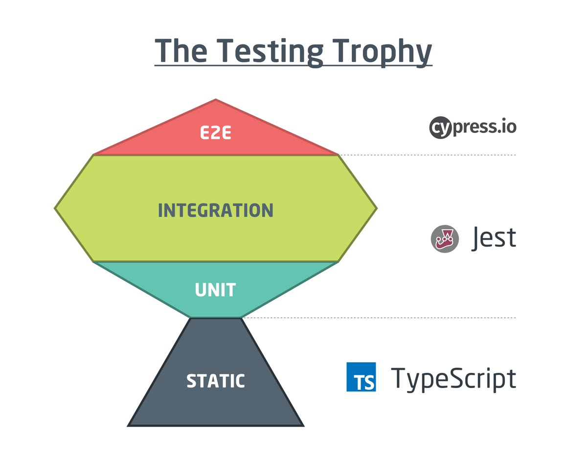

# vue-testing-example

## Project setup
```
yarn install
```

### Compiles and hot-reloads for development
```
yarn serve
```

### Compiles and minifies for production
```
yarn build
```

### Run your unit tests
```
yarn test:unit
```

### Run your end-to-end tests
```
yarn test:e2e
```

### Lints and fixes files
```
yarn lint
```




### Articles
[The Testing Garden of Kent C. Dodds](https://kentcdodds.com/testing/)